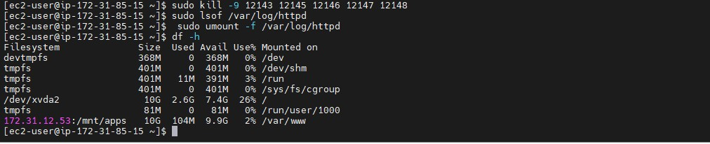
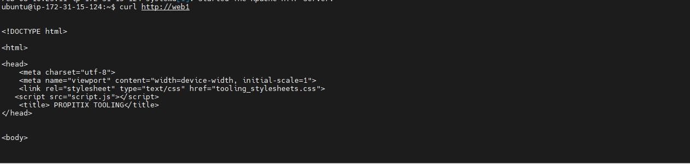
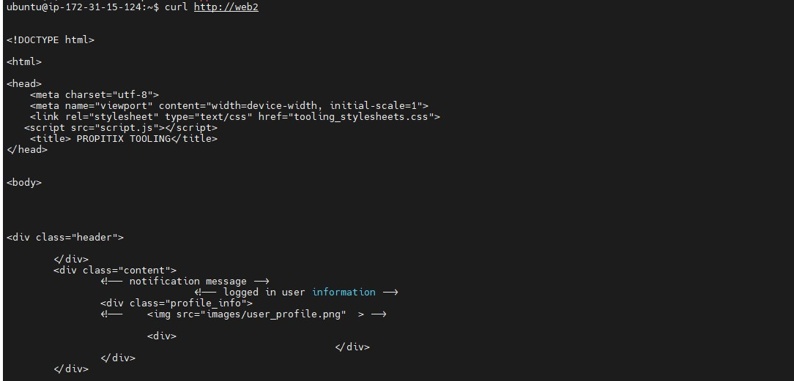
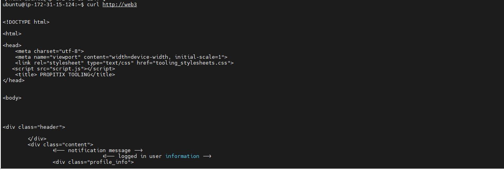

# Project8: Configure a load balancer for the tooling website implemented in project 7

### Create an instance and open port 80

### Install apache load balancer on the server and configure it to point traffic to your 3 web servers

```
#Install apache2
sudo apt update
sudo apt install apache2 -y
sudo apt-get install libxml2-dev

#Enable following modules:
sudo a2enmod rewrite
sudo a2enmod proxy
sudo a2enmod proxy_balancer
sudo a2enmod proxy_http
sudo a2enmod headers
sudo a2enmod lbmethod_bytraffic
```
### Restart the apache service
`sudo systemctl restart apache2`

### Configure load balancing
`sudo vi /etc/apache2/sites-available/000-default.conf`

```
sudo vi /etc/apache2/sites-available/000-default.conf

#Add this configuration into this section <VirtualHost *:80>  </VirtualHost>

<Proxy "balancer://mycluster">
               BalancerMember http://<WebServer1-Private-IP-Address>:80 loadfactor=5 timeout=1
               BalancerMember http://<WebServer2-Private-IP-Address>:80 loadfactor=5 timeout=1
               ProxySet lbmethod=bytraffic
               # ProxySet lbmethod=byrequests
        </Proxy>

        ProxyPreserveHost On
        ProxyPass / balancer://mycluster/
        ProxyPassReverse / balancer://mycluster/

#Restart apache server

sudo systemctl restart apache2
```


### Verify your configuration works. Try to access your load balancer's public Ip address from your service


### In project 7, you mounted /var/log/httpd/ from your web servers was mounted to the NFS server, unmount them and make sure each webserver has it's own log directory.
### If shwown "device is busy" when trying to unmount, terminate the processes:

`sudo yum install lsof`

### Identify the processes
`sudo lsof /var/log/httpd`


### Kill the processes
`sudo kill -9 <PID> <PID> <PID>`


### Unmount
`sudo umount -f /var/log/httpd `



### Proceed to open 2 putty consoles for each of the 3 webservers and run the following command
`sudo tail -f /var/log/httpd/access_log`


### Refresh your browser page several times so all 3 servers receive HTTPD GET requests from your Load-Balancer. New records should appear in each server's log file


### map the servers ip addresses to host names in the LB /etc/hosts file

`sudo vi /etc/hosts`


### Update your LB config file with the names instead of Ip address
`sudo vi /etc/apache2/sites-available/000-default.conf`


### Curl your local host
`curl http://web1`
`curl http://Web2`
`curl http://Web3`





